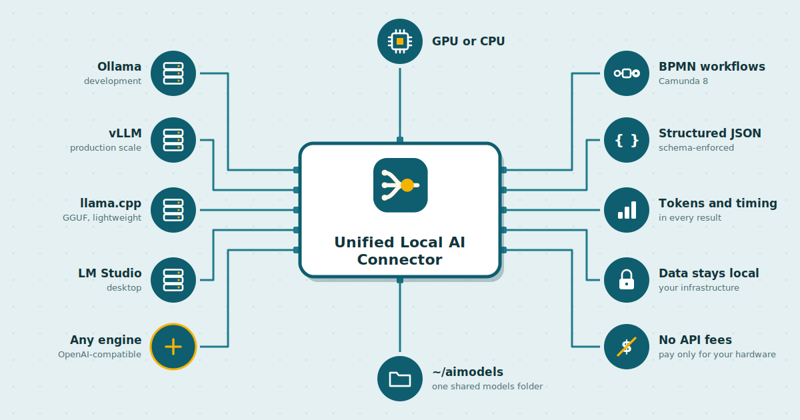

<p align="center">
  
</p>

<h1 align="center">Unified Local AI Connector for Camunda 8</h1>

<p align="center">
  <b>One connector. Any local inference engine.</b><br>
  <i>Bring local AI directly into Camunda workflows, without changing your BPMN when you switch inference engines.</i>
</p>

<p align="center">
  
</p>

**Build AI-powered Camunda workflows once, run them against local inference engines, and switch engines without rewriting the BPMN process.**

## Why this connector?

Without a unified connector, every engine is its own integration:

```
Camunda → Ollama
Camunda → vLLM
Camunda → LM Studio
Camunda → llama.cpp
```

Each integration can require different configuration, and switching engines can mean changing the process.

With this connector:

```
Camunda → Unified Local AI Connector → Any OpenAI-compatible engine
```

The BPMN task stays the same. Change the **Provider**, **Base URL**, and **Model**.

> **Full setup guide as slides:** [docs/unified-local-ai-connector.pptx](docs/unified-local-ai-connector.pptx) (31 slides: the problem, how it works, benchmark, and every setup step).

---

## Contents

1. [Why this connector?](#why-this-connector)
2. [What this connector does](#what-this-connector-does)
3. [Why it is called Unified](#why-it-is-called-unified)
4. [Supported engines and what is coming](#supported-engines-and-what-is-coming)
5. [The problem it solves](#the-problem-it-solves)
6. [How it works](#how-it-works)
7. [Features](#features)
8. [Ollama vs vLLM](#ollama-vs-vllm)
9. [Example benchmark on RTX 3050](#example-benchmark-on-rtx-3050)
10. [Choose your setup](#choose-your-setup)
11. [Setup guide (8 steps)](#setup-guide)
12. [Using the connector](#using-the-connector)
13. [Example processes](#example-processes)
14. [Benchmark it yourself](#benchmark-it-yourself)
15. [Troubleshooting](#troubleshooting)
16. [Adding another engine](#adding-another-engine)
17. [Project structure](#project-structure)
18. [License and credits](#license-and-credits)

---

## What this connector does

The Unified Local AI Connector is a **Camunda 8 outbound connector** that lets a BPMN service task send a prompt to an AI model running on **your own infrastructure** and get the answer back as process variables.

You add it to a process like any other service task, choose the inference engine, write a prompt (process variables can go into it with FEEL), and the answer lands in your process: as plain text, or as structured JSON that the next steps and gateways can use directly. Every result also carries token counts and response time.

What that gives you:

- **No per-request AI API fees.** Run inference on your own hardware and pay only for the infrastructure you operate.
- **Private by design.** Prompts and answers never leave your infrastructure.
- **Real workflow integration.** Summarize, classify, extract, and route inside BPMN, with retries and BPMN error handling built in.

## Why it is called Unified

Local AI is not one product. There are many **inference engines** (the servers that actually run a model), each with its own strengths, setup, and API paths. Connecting a workflow to one engine usually means that the process is tied to that engine.

This connector **unifies them behind one element**:

```
                    UNIFIED LOCAL AI CONNECTOR

                         Camunda BPMN
                              │
                              ▼
                  ┌─────────────────────┐
                  │  One Service Task   │
                  │  Unified Connector  │
                  └──────────┬──────────┘
                             │
             ┌───────────────┼───────────────┐
             ▼               ▼               ▼
          Ollama            vLLM        Other engines
          GGUF             HF/AWQ        OpenAI API
```


- **One connector, one element template.** The same service task works with every supported engine.
- **One standard API.** Every engine is called through the OpenAI-compatible `POST /v1/chat/completions` endpoint, which most modern inference engines support.
- **One result format.** Whatever engine answers, your process gets the same fields: `answer`, `json`, tokens, time, model, and provider.
- **The engine is a dropdown, not an integration project.** Moving a process from one engine to another means changing the **Provider**, **Base URL**, and **Model** fields. The rest of the BPMN stays the same.

## Supported engines and what is coming

| Provider option in the element | Status |
|---|---|
| **Ollama** | Supported and tested |
| **vLLM** | Supported and tested |
| **Other OpenAI-compatible server** | Works today with any engine that exposes `/v1/chat/completions` (for example LM Studio or the llama.cpp server) |

**Roadmap:** this repo will be updated with more inference engines. Each new engine will get **its own option in the connector element's Provider dropdown**, with its own Base URL default, help text, and a tested setup guide, so choosing an engine in Modeler becomes a single click. Ideas and pull requests are welcome through GitHub issues.

The first two engines cover two common use cases: **Ollama** for local development and demos, and **vLLM** for serving higher-concurrency workloads. The rest of this guide shows both in detail.

## The problem it solves

| Problem | What happens today |
|---|---|
| **Pay per request** | Cloud AI APIs charge for every call. A workflow running thousands of times a day turns AI into a growing bill. |
| **Data leaves your walls** | Tickets, contracts, and patient notes go to a third-party API. Many teams are not allowed to do that. |
| **Every engine is different** | Each inference engine has its own setup and API paths. Switching means rework in every process. |
| **Laptop vs production gap** | The engine that is easy on a laptop is not the one that handles production load. |

## How it works

```
BPMN service task  ──►  Camunda Connectors runtime  ──►  POST {baseUrl}/v1/chat/completions  ──►  Inference engine
(prompt, provider,       (runs this connector jar)        (OpenAI-compatible request)              (any supported engine)
 model)                                                                                                    │
        ◄──────────────────────────  process variables: answer, json, tokens, time  ◄───────────────────────┘
```

The same process model runs on a laptop and on a GPU server. Only the **Provider**, **Base URL**, and **Model** fields change.

## Features

- **Provider dropdown:** choose the inference engine per task. Base URL defaults and help text change with the choice.
- **Text or JSON output:** JSON mode with an optional JSON schema. The answer is parsed, so later steps can use `json.fieldName` directly.
- **Metadata in every result:** prompt, completion, and total tokens, response time in milliseconds, model, provider, and finish reason.
- **Clear error codes** for BPMN error handling (`AI_TIMEOUT`, `AI_UNREACHABLE`, and more).
- **Retries with backoff:** 3 retries, 30 seconds apart by default, so a restarting model server has time to come back.
- **Lightweight:** a small jar (about 10 KB) with no bundled libraries, using Java's built-in HTTP client over HTTP/1.1.

## Ollama vs vLLM

The two engines supported today, and when to use each.

| | Ollama | vLLM |
|---|---|---|
| Built for | Running models easily | Serving models at scale |
| Best stage | Development, demos | Production traffic |
| Hardware (this setup) | Any laptop, CPU or GPU | NVIDIA GPU required for this setup |
| Setup | Minutes | More configuration |
| Many requests at once | Queue up | Batched together on the GPU |
| Model format | GGUF | Hugging Face (AWQ, safetensors) |
| JSON schema | Supported | Strictly enforced |

**Rule of thumb: Build with Ollama. Scale with vLLM.** Build and test with Ollama, then switch the Provider to vLLM when many workflows call the model at the same time.

## Example benchmark on RTX 3050

Same model on both engines: **Qwen 2.5 1.5B Instruct, 4-bit** (vLLM: AWQ, Ollama: GGUF Q4_K_M). NVIDIA RTX 3050 Laptop GPU (4 GB), one engine running at a time. Prompt: one-sentence ticket summary, max 64 tokens, temperature 0. Measured with [`deploy/bench.sh`](deploy/bench.sh).

| Parallel requests | Ollama total | vLLM total | Ollama throughput | vLLM throughput |
|---|---|---|---|---|
| 1  | 0.17 s | 0.42 s | 5.88 req/s | 2.37 req/s |
| 5  | 0.76 s | 0.52 s | 6.61 req/s | 9.61 req/s |
| 10 | 1.49 s | 0.53 s | 6.72 req/s | 19.00 req/s |
| 20 | 2.99 s | 0.58 s | 6.70 req/s | 34.21 req/s |

For a single request, Ollama responds faster. Under concurrent load, Ollama's throughput levels off at about 6.7 requests per second, while vLLM batches requests on the GPU: 20 parallel requests finished in 0.58 s, about 5x faster than Ollama, with 5x the throughput.

These numbers come from a small laptop GPU with short answers; results differ on other hardware. The pattern (Ollama levels off, vLLM scales) is what matters.

## Choose your setup

| Category | Engine | Hardware | Needs |
|---|---|---|---|
| CPU only | Ollama on CPU | Any laptop | No NVIDIA driver, no toolkit (slower) |
| GPU: development | Ollama on GPU | NVIDIA GPU | Driver + NVIDIA Container Toolkit |
| GPU: production | vLLM | NVIDIA GPU (required for this setup) | Driver with CUDA 13+ + NVIDIA Container Toolkit |
| Both | Ollama + vLLM | Larger GPU, or one at a time on 4 GB | Driver + toolkit |

Everything else in this guide is the same for every category. CPU-only users skip Step 1.

### Prerequisites

- Windows with **WSL2 Ubuntu** (all commands run in the Ubuntu terminal), or a Linux machine
- **Docker Engine** with Docker Compose v2
- **NVIDIA driver** (GPU setups only): `nvidia-smi` should show CUDA 13 or newer for the latest vLLM image
- **Camunda 8.9 Self-Managed** docker-compose distribution: download it from [camunda/camunda-distributions](https://github.com/camunda/camunda-distributions) (`docker-compose/versions/camunda-8.9`). It provides the `configuration/` folder that the compose file uses.
- **Maven** and **JDK 21** to build the connector
- **Camunda Desktop Modeler**

---

## Setup guide

### Step 1: Give Docker access to the GPU

*GPU setups only. Skip for Ollama on CPU.*

```bash
nvidia-smi                                   # the GPU must be visible in WSL

curl -fsSL https://nvidia.github.io/libnvidia-container/gpgkey \
  | sudo gpg --dearmor -o /usr/share/keyrings/nvidia-container-toolkit-keyring.gpg
curl -s -L https://nvidia.github.io/libnvidia-container/stable/deb/nvidia-container-toolkit.list \
  | sed 's#deb https://#deb [signed-by=/usr/share/keyrings/nvidia-container-toolkit-keyring.gpg] https://#g' \
  | sudo tee /etc/apt/sources.list.d/nvidia-container-toolkit.list
sudo apt-get update && sudo apt-get install -y nvidia-container-toolkit

sudo nvidia-ctk runtime configure --runtime=docker
sudo nvidia-ctk cdi generate --output=/etc/cdi/nvidia.yaml
sudo systemctl restart docker

# test: should print your GPU table
docker run --rm --gpus all nvidia/cuda:12.4.1-base-ubuntu22.04 nvidia-smi
```

After every NVIDIA driver update, run the `cdi generate` line and restart Docker again.

### Step 2: Create the shared models folder

One folder for all engines, organized by file format, so engines that read the same format share the same files:

```bash
mkdir -p ~/aimodels/{huggingface,gguf,ollama,cache}
sudo chown -R $USER:$USER ~/aimodels
```

```
~/aimodels/
├── huggingface/   vLLM models (and SGLang, TGI)
│   └── qwen2.5-1.5b-awq/
├── gguf/          GGUF files (llama.cpp, LM Studio, Ollama imports)
├── ollama/        Ollama's own store
│   └── models/
└── cache/         download cache
```

- Keep it inside Linux (`~/aimodels`). Folders on `/mnt/c` or `/mnt/d` work but load much slower.
- Browse it from Windows File Explorer at `\\wsl$\Ubuntu\home\<your-user>\aimodels`.
- Naming rule: `family-size-variant`, lowercase, for example `qwen2.5-1.5b-awq`.

### Step 3: Download models

**vLLM** (Hugging Face format). No Python needed: the vLLM image includes the `hf` download tool.

```bash
docker run --rm -v ~/aimodels/huggingface:/models --entrypoint hf vllm/vllm-openai:latest \
  download Qwen/Qwen2.5-1.5B-Instruct-AWQ --local-dir /models/qwen2.5-1.5b-awq
sudo chown -R $USER:$USER ~/aimodels
```

The first run also downloads the vLLM image (about 10 GB), which the compose file reuses later.

**Ollama** (after the `ollama` container is running, Step 6):

```bash
docker exec -it ollama ollama pull qwen2.5:1.5b
docker exec -it ollama ollama list
```

> **Why two copies of the same model?** vLLM reads Hugging Face AWQ files, Ollama reads GGUF files. Each engine gets the format it runs fastest; the extra copy is about 1 GB.

Check your models at any time:

```bash
du -sh ~/aimodels/*
ls ~/aimodels/huggingface
```

### Step 4: Build the connector

```bash
mvn clean package
```

This creates `target/unified-local-ai-connector-0.1.0.jar`. Copy it into your Camunda 8.9 docker-compose folder (next to `docker-compose.yaml`). Or download the jar from the [Releases](../../releases) page.

### Step 5: Set up docker-compose.yaml

Copy [`deploy/docker-compose.yaml`](deploy/docker-compose.yaml) into the Camunda 8.9 folder, replacing the original. It keeps Camunda's lightweight setup and adds:

- the connector jar, mounted into the Connectors container:
  ```yaml
  volumes:
    - ./unified-local-ai-connector-0.1.0.jar:/opt/custom/unified-local-ai-connector.jar
  ```
- a **vLLM** service and an **Ollama** service, each with `profiles: ["engine"]`, so they start only when you name them.

Also create `connector-secrets.txt` next to it (see [`deploy/connector-secrets.example.txt`](deploy/connector-secrets.example.txt)); an empty file is fine.

Key settings in the vLLM service:

| Setting | Value | Why |
|---|---|---|
| `--model` | `/models/qwen2.5-1.5b-awq` | Path inside the container; `/models` is `~/aimodels/huggingface` |
| `--served-model-name` | `qwen2.5-1.5b-awq` | The model name you type in the connector |
| `--gpu-memory-utilization` | `0.7` | Laptop GPUs also drive the display; use `0.9` on a dedicated server |
| `--max-model-len` | `4096` | Maximum tokens per request (prompt plus answer) |
| `--enforce-eager` | on | Saves GPU memory on small GPUs |
| `networks: camunda` | | Lets the connector reach `http://vllm:8000` |

Switch vLLM models without editing the file:

```bash
VLLM_MODEL=/models/qwen2.5-3b-awq VLLM_MODEL_NAME=qwen2.5-3b-awq docker compose up -d vllm
```

**Ollama on CPU:** delete the `deploy:` section of the `ollama` service. It then runs without any NVIDIA software, just slower.

### Step 6: Start, stop, and verify

| Command | What it does |
|---|---|
| `docker compose up -d` | Camunda only (engines stay off) |
| `docker compose up -d orchestration connectors vllm` | Camunda + vLLM |
| `docker compose up -d orchestration connectors ollama` | Camunda + Ollama |
| `docker compose up -d orchestration connectors ollama vllm` | Camunda + both engines |
| `docker compose up -d ollama vllm` | Only the engines (Camunda already running) |
| `docker compose stop vllm` | Stop one engine |
| `docker compose --profile "*" down` | Stop everything, including engines |

A plain `docker compose down` skips the engines and leaves them running, so use `--profile "*"` to stop everything. On a 4 GB GPU, run one GPU engine at a time.

vLLM takes about a minute to load the model. Watch it with `docker logs -f vllm` until you see "Application startup complete."

**Verify from two places:**

```bash
curl http://localhost:8000/v1/models                                           # from your machine
docker exec -it connectors sh -c "wget -T 5 -qO- http://vllm:8000/v1/models"   # from Camunda
```

For Ollama, use `localhost:11434` and `http://ollama:11434`.

| From your machine | From Camunda | Meaning |
|---|---|---|
| Works | Works | Everything is fine |
| Works | Fails | The engine runs, but Camunda can't reach it: check `networks: camunda` |
| Fails | Fails | The engine isn't ready or crashed: check `docker logs vllm` |

Check that the connector jar loaded:

```bash
docker exec connectors ls -la /opt/custom     # must show the .jar as a file, not a folder
```

### Step 7: Install the element template

Copy [`element-templates/unified-local-ai-connector.json`](element-templates/unified-local-ai-connector.json) into:

```
%APPDATA%\camunda-modeler\resources\element-templates\
```

Restart Desktop Modeler. Keep only one copy of this template in the folder.

### Step 8: Add it to a process

Add a service task, click the wrench icon, and choose **Unified Local AI Connector**. Then fill in:

| Provider | Base URL | Model |
|---|---|---|
| vLLM | `http://vllm:8000` | `qwen2.5-1.5b-awq` (your `--served-model-name`) |
| Ollama in Docker | `http://ollama:11434` | `qwen2.5:1.5b` (from `ollama list`) |
| Ollama on the host | `http://host.docker.internal:11434` | from `ollama list` |
| Other | `http://<server>:<port>` | from `<base URL>/v1/models` |

The Model field starts empty on purpose: enter the model actually running in your engine.

---

## Using the connector

### Fields

| Group | Field | Notes |
|---|---|---|
| Connection | Provider, Base URL, Model | See Step 8 |
| Connection | API key | Optional; use a secret like `{{secrets.LOCAL_AI_API_KEY}}` |
| Connection | Timeout (seconds) | Default 120; first calls are slower while a model loads |
| Prompt | System prompt | Optional instructions for the model |
| Prompt | User prompt | Required; FEEL works, e.g. `="Summarize: " + ticketText` |
| Model options | Temperature, Max tokens | Defaults 0.2 and 512 |
| Output format | Output mode, JSON schema | Text, or JSON with an optional schema |
| Output mapping | Result variable / Result expression | Without one of them, the answer is not stored |
| Error handling | Error expression | Turn error codes into BPMN errors |
| Retries | Retries, Retry backoff | Defaults 3 and `PT30S` |

### Output

Set **Result variable** (for example `aiResult`) to store everything, or **Result expression** to pick fields:

```
={ aiAnswer: answer, tokens: totalTokens, timeMs: durationMs }
```

The connector returns:

```json
{
  "answer": "The customer's payment failed twice and they need account access today.",
  "json": { "category": "billing", "urgent": true },
  "promptTokens": 45,
  "completionTokens": 18,
  "totalTokens": 63,
  "durationMs": 820,
  "model": "qwen2.5-1.5b-awq",
  "provider": "vllm",
  "finishReason": "stop"
}
```

`json` is present only in JSON mode.

### JSON mode

Set **Output mode** to JSON and add a schema. The engine is forced to return exactly these fields (strictest on vLLM; test on Ollama before relying on it):

```json
{
  "type": "object",
  "properties": {
    "category": { "type": "string", "enum": ["billing", "technical", "general"] },
    "urgent": { "type": "boolean" }
  },
  "required": ["category", "urgent"]
}
```

Result expression:

```
={ category: json.category, urgent: json.urgent }
```

Use `category` in a gateway condition to route the process.

### Error codes

| Code | Meaning |
|---|---|
| `AI_UNREACHABLE` | The server could not be reached (not running, still loading, or wrong URL) |
| `AI_TIMEOUT` | No answer within the timeout |
| `AI_HTTP_<status>` | The server returned an error, e.g. `AI_HTTP_404` for an unknown model or path |
| `AI_INVALID_JSON` | JSON mode was on, but the answer was not valid JSON |
| `AI_INVALID_SCHEMA` | The JSON schema field is not valid JSON |
| `AI_INVALID_INPUT` | A required field is empty or a number field is not a number |

Example error expression that turns a timeout into a BPMN error you can catch with a boundary event:

```
=if error.code = "AI_TIMEOUT" then bpmnError("AI_TIMEOUT", error.message) else null
```

## Example processes

In [`examples/`](examples):

| File | What it shows | Start variables |
|---|---|---|
| `local-ai-test.bpmn` | Summarize a ticket (text), then classify it (JSON) | `provider`, `baseUrl`, `model`, `ticketText` |
| `local-ai-parallel-test.bpmn` | A parallel gateway sends the same ticket to vLLM and Ollama at once | `ticketText` |

Start `local-ai-test.bpmn` with:

```json
{
  "provider": "vllm",
  "baseUrl": "http://vllm:8000",
  "model": "qwen2.5-1.5b-awq",
  "ticketText": "My payment failed twice this morning and I cannot access my account. I need this fixed today."
}
```

For Ollama: `"provider": "ollama"`, `"baseUrl": "http://ollama:11434"`, `"model": "qwen2.5:1.5b"`.

The parallel test writes prefixed variables (`vllmSummary`, `ollamaSummary`, `vllmMs`, `ollamaMs`, and so on), so both answers can be compared side by side in Operate. It needs both engines running; on a 4 GB GPU they share the GPU, so expect slower times than the benchmark.

## Benchmark it yourself

[`deploy/bench.sh`](deploy/bench.sh) sends N parallel requests to any OpenAI-compatible server and reports total time, average latency, and throughput. Copy it next to `docker-compose.yaml`:

```bash
sed -i 's/\r$//' bench.sh && chmod +x bench.sh

# Ollama
docker compose stop vllm && docker compose up -d ollama
for n in 1 1 5 10 20; do ./bench.sh http://localhost:11434 qwen2.5:1.5b $n; done

# vLLM
docker compose stop ollama && docker compose up -d vllm
until curl -sf http://localhost:8000/v1/models > /dev/null; do sleep 5; done
for n in 1 1 5 10 20; do ./bench.sh http://localhost:8000 qwen2.5-1.5b-awq $n; done
```

The first run of each engine is a warm-up. For a fair comparison, use the same model size and run one engine at a time.

## Troubleshooting

| You see | Cause | Fix |
|---|---|---|
| `no known GPU vendor found` | Docker can't use the GPU | Install the NVIDIA Container Toolkit and run `cdi generate` (Step 1) |
| `NVIDIA driver on your system is too old` | The vLLM image needs a newer CUDA | Update the Windows NVIDIA driver, restart, run `cdi generate` again |
| `Free memory on device ... is less than desired` | The display uses part of the GPU | Lower `--gpu-memory-utilization` to 0.7 or 0.6 |
| Tasks wait forever, no incident | The jar isn't loaded (Docker mounted an empty folder) | Fix the jar file name in the volume, then `docker compose up -d --force-recreate connectors` |
| `AI_UNREACHABLE` right after startup | The model is still loading | Wait for "Application startup complete"; the 30 s retry backoff covers this |
| `AI_HTTP_404` | Wrong model name or path | Check the name with `/v1/models`; Base URL must not end in `/v1` |
| Template shows "Not found" | The task uses a template version that isn't installed | Keep old template versions installed, or re-apply the template |
| `network ... still in use` | Engines left running | `docker compose --profile "*" down` |
| `mv: Permission denied` in `~/aimodels` | Downloads are owned by root | `sudo chown -R $USER:$USER ~/aimodels` |
| Port 11434 already in use | Ollama is also installed on the host | `sudo systemctl stop ollama` (and `disable` to keep it off) |

## Adding another engine

Any server with an OpenAI-compatible `/v1/chat/completions` API works without connector changes:

1. Add a service to `docker-compose.yaml`:
   ```yaml
   newengine:
     image: <engine image>
     container_name: newengine
     profiles: ["engine"]
     command: >
       <start options, model path under /models>
     ports:
       - "<free host port>:<engine port>"
     volumes:
       - ~/aimodels/<format folder>:/models:ro
     networks:
       - camunda
     deploy:
       resources:
         reservations:
           devices:
             - driver: nvidia
               count: all
               capabilities: [gpu]
   ```
2. Start it: `docker compose up -d newengine`
3. In the task, choose **Other OpenAI-compatible server**, Base URL `http://newengine:<engine port>`.

## Project structure

```
unified-local-ai-connector/
├── src/main/java/io/github/rajeshponna/localai/   connector source (Java 21)
├── src/main/resources/META-INF/services/          connector registration
├── element-templates/                             Desktop Modeler template
├── deploy/
│   ├── docker-compose.yaml                        Camunda 8.9 + connector + vLLM + Ollama
│   ├── connector-secrets.example.txt
│   └── bench.sh                                   benchmark script
├── examples/                                      test BPMN processes
├── docs/
│   ├── unified-local-ai-connector.pptx            full setup guide as slides
│   └── images/                                    icon and illustration
└── pom.xml
```

## License and credits

- **This connector:** Apache 2.0.
- **Camunda:** this setup uses Camunda 8 Self-Managed images, which are free for development and testing. Production use requires a Camunda Enterprise license; see Camunda's licensing terms.
- **Engines and models:** vLLM (Apache 2.0), Ollama (MIT), Qwen 2.5 (Apache 2.0). Models are downloaded by each user and are not part of this repository.

This is a community project and is not affiliated with or endorsed by Camunda.

**Created by Rajesh Ponna.**